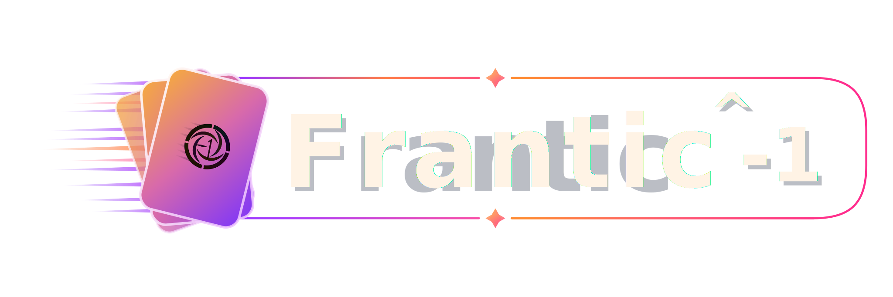

<p align="center">
  
</p>

<p align="center">
  A multiplayer card game developed for the <i>Programmierprojekt</i> course at the University of Basel.
</p>

<p align="center">
  <a href="https://ayanomaliy.github.io/not-frantic/">Project Website</a>
</p>

---

## About the Project

**Frantic^-1** is a multiplayer card game inspired by *Frantic*, but with our own rules, special cards, event cards, networking, custom assets, and a JavaFX GUI.

The project was developed by **The Devs^-1** as part of the **Programmierprojekt** course at the **University of Basel**.

---

## Running the Game

The game can be started from the generated JAR file.

### Server

```bash
java -jar not-frantic.jar server [port]
````

### Client

```bash
java -jar not-frantic.jar client [host:port] [username]
```

If no port is specified, the default port is `5555`.

For a more detailed explanation, see the manual in the documentation folder.

---

## Documentation

* [Project Website](https://ayanomaliy.github.io/not-frantic/)
* [Manual](outreach/not-frantic-manual.pdf)
* [QA Concept Report](docs/QA%20Concept%20Report.pdf)
* [Network Protocol](docs/protocol_document.md)
* [Game Rules](docs/Game%20Rules.pdf)
* [Diary](docs/Diary.md)

---


## Outreach

The required outreach material can be found in the [`outreach/`](outreach/) folder.

This includes:

* [`game.properties`](outreach/game.properties)
* [`gameplay.mp4`](outreach/gameplay.mp4)
* [`not-frantic-manual.pdf`](outreach/not-frantic-manual.pdf)
* [`screenshot.png`](outreach/screenshot.png)
* [`trailer.mp4`](outreach/trailer.mp4)

## Developers

<p align="left">
  
</p>

* Aiysha Mei Frutiger
* Denys Verich
* Senanur Ates
* Sevval Ünlü

