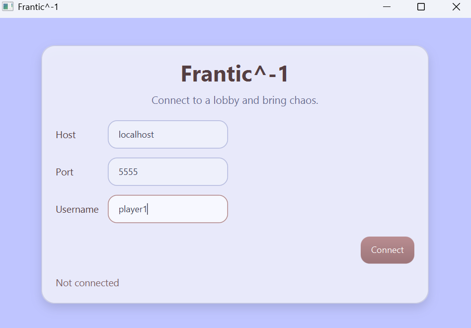
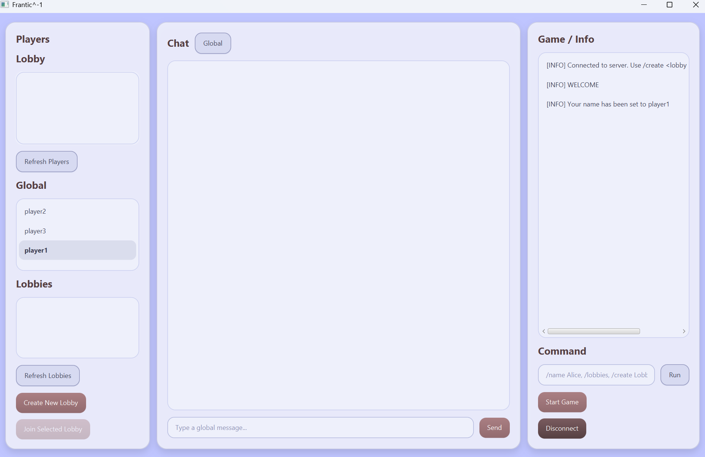
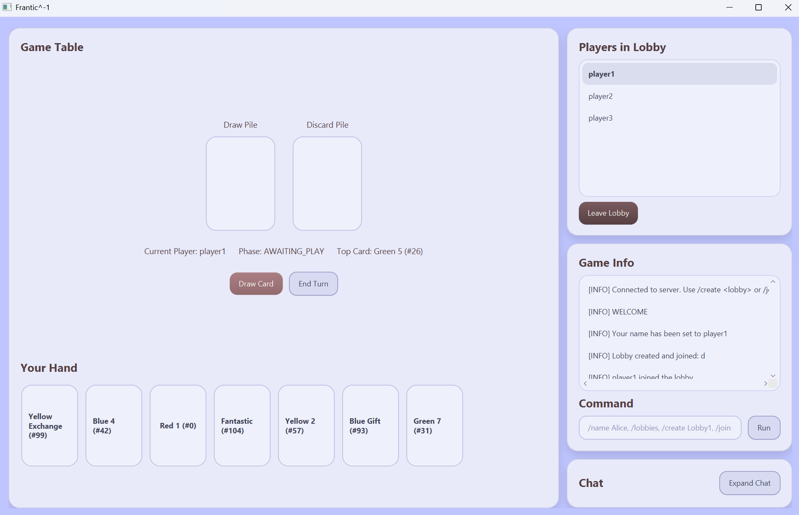

# Frantic^-1 Manual

This manual explains how to use and play **Frantic^-1** with the **GUI client**.

It is written for someone who receives the JAR file and has never seen the project before. It reflects the current implementation in the source code. :contentReference[oaicite:0]{index=0} 

---

## 1. What You Need

To run the game, you need:

- **Java 25**
- the JAR file `not-frantic.jar`

All commands in this manual assume that you are in the folder containing the JAR.

---

## 2. How to Start the Server

One person must start the server first.

Run:

```bash
java -jar not-frantic.jar server
````

This starts the server on the default port **5555**.

If you want to use a specific port, run:

```bash
java -jar not-frantic.jar server <port>
```

Example:

```bash
java -jar not-frantic.jar server 5555
```

---

## 3. How to Start the GUI Client

To open the graphical client, run:

```bash
java -jar not-frantic.jar client
```

This opens the **Connect View** with the default host `localhost` and default port `5555`.

You can also prefill the connection data directly from the command line:

```bash
java -jar not-frantic.jar client localhost:5555
```

or

```bash
java -jar not-frantic.jar client localhost:5555 Alice
```

This opens the GUI with the host, port, and optionally the username already entered. You can still adjust those values in the Connect View before pressing **Connect**.



---

## 4. How to Connect

When the GUI opens, you will see the **Connect View**.

There are three fields:

* **Host**
* **Port**
* **Username**

### Typical values

If the server is running on your own computer, use:

* Host: `localhost`
* Port: `5555`

Enter a username you want to use, then click **Connect**.

If the connection works, you will enter the **Lobby View**.

---

## 5. What Happens After Connecting

After connecting, you are in the **Lobby View**.

This screen contains:

* a list of players
* a list of available lobbies
* chat
* a command field
* buttons to create, join, leave, and start games

The GUI has buttons for common actions, but it also has a **command field**. That field supports slash commands such as `/create`, `/join`, `/start`, `/play`, and many more.



---

## 6. How to Create a Lobby

To create a new lobby, use the **Create New Lobby** button.

A dialog will open and ask for the lobby name.

Enter a name, for example:

```text
TestLobby
```

After creating it, you join that lobby automatically.

You can also create a lobby through the command field:

```text
/create TestLobby
```

---

## 7. How to Join a Lobby

If another player already created a lobby, you can join it in two ways.

### Method 1: use the lobby list

* click the lobby in the lobby list
* press **Join Selected Lobby**

You can also double-click a lobby entry.

### Method 2: use the command field

```text
/join TestLobby
```

---

## 8. How to Leave a Lobby

To leave the current lobby, click **Leave Lobby**.

Or use:

```text
/leave
```

---

## 9. How to Start a Game

Once enough players are in the same lobby, press **Start Game**.

Or use:

```text
/start
```

When the game starts, the GUI switches to the **Game View**.

---

## 10. The Game View



The game screen shows several areas:

### Left / center area

This is the main game area. It shows:

* the draw pile
* the discard pile
* the current player
* the current phase
* the top card
* your hand

### Right side

The right side contains:

* players in the current lobby
* game/info log
* command field
* chat

### Bottom / hand area

Your current hand is shown as clickable card buttons.

You can either:

* click a card button to play it
* or use slash commands in the command field

---

## 11. Goal of the Game

The goal is to get rid of all cards in your hand.

If you are the first player to reach **0 cards**, you usually win the **round**.

The game continues over multiple rounds, and players collect score points from cards left in their hand.

At the end of the full match, the player with the **lowest total score** wins.

---

## 12. How a Round Starts

At the start of each round:

* the deck is freshly built and shuffled
* each player receives **7 cards**
* one normal color card is placed on the discard pile
* round 1 starts with alphabetical player order
* later rounds are ordered by score, with the highest score playing first

---

## 13. How to Play a Turn

On your turn, you usually do one of these:

* play a legal card
* draw a card

After that, you may end your turn if the situation allows it.

### To draw a card

Click **Draw Card** or type:

```text
/draw
```

### To end your turn

Click **End Turn** or type:

```text
/end
```

### To play a card

Click the card in your hand or type:

```text
/play <cardId>
```

Example:

```text
/play 81
```

### Important note about hand updates

If the GUI does not seem to update your hand correctly, type:

```text
/hand
```

to request a fresh hand update from the server.

### Important note about effect resolution

During effect resolution, clickable card play in the GUI may not always be enough on its own yet.

If the game asks you to resolve an effect, use the **command input**.

---

## 14. How Normal Cards Work

There are normal colored number cards.

A normal card can be played if:

* it matches the **color** of the top discard card
* or it matches the **number** of the top discard card

Example:

* top card is **Red 5**
* you may play another **Red** card
* or any **5**

---

## 15. Black Cards and Special Cards

There are three important groups of non-normal cards:

* **black cards**
* **single-color special cards**
* **four-color special cards**

This section explains what they do and, most importantly, what you need to type in the **command input** when the game asks you to resolve an effect.

### Important rule for commands

When a command asks you for a card, you must type the **card ID**.

Do **not** type the card name, color, or value.

For example:

* correct: `/secondchance 82`
* wrong: `/secondchance red skip`
* wrong: `/secondchance red 7`

The GUI shows the card ID directly on the card, for example:

* `Red Skip (#82)`
* `Blue Gift (#93)`

So always use the number shown on the card.

---

## 16. Black Cards

Black cards also have numbers.

A black card can be played if:

* its number matches the top discard card’s number
* and the top discard card is **not** black

When you play a black card, the game automatically triggers an **event card**.

You do **not** type a command to resolve the event. The server handles it automatically.

### What you should do after playing a black card

After playing a black card:

1. wait for the event to be applied
2. look at the **Game / Info** area
3. check whose turn it is now
4. check whether your hand or the top card changed
5. continue playing when the game allows it

Event cards can, for example:

* make players draw cards
* skip players
* reverse the order
* discard cards
* end the round immediately
* block special cards
* change scoring for the round

So when you play a black card, pay attention to the game log and the updated state.

---

## 17. Special Cards and How to Resolve Them

Some special cards need extra input after being played.

When that happens, the game tells you that an effect is waiting to be resolved. Then you type the correct command into the **command input**.

### Important: when do I have to type an effect command?

Whenever the **Game / Info** area shows an `EFFECT_REQUEST` message, the game is waiting for you to resolve a special effect.

That is your signal that you must type the matching command into the **command input**.

Example:

```text
EFFECT_REQUEST|SECOND_CHANCE:Alice
```

This means Alice now has to type a command such as:

```text
/secondchance 82
```

or

```text
/secondchance draw
```

So the general rule is:

* if you see `EFFECT_REQUEST`, you must resolve the effect in the command input
* if you do **not** see `EFFECT_REQUEST`, then the game is usually resolving automatically

Below are the most important special effects. For each one, you can see:

* what the card does
* when you need to type something
* exactly what command to enter
* an example

---

### 17.1 Second Chance

**What it does:**
Lets you immediately play another card.
If you do not want to play another card, you draw instead.

**What to type:**
If you want to play another card:

```text
/secondchance <cardId>
```

If you want to draw instead:

```text
/secondchance draw
```

**Examples:**

```text
/secondchance 82
/secondchance draw
```

---

### 17.2 Skip

**What it does:**
Choose one player whose next turn will be skipped.

**What to type:**

```text
/skip <playerName>
```

**Example:**

```text
/skip Bob
```

---

### 17.3 Gift

**What it does:**
Give one or two cards from your hand to another player.

**What to type:**

```text
/gift <playerName> <cardId1>
```

or

```text
/gift <playerName> <cardId1> <cardId2>
```

**Examples:**

```text
/gift Bob 81
/gift Bob 81 82
```

---

### 17.4 Exchange

**What it does:**
Exchange two of your cards with another player.

**What to type:**

```text
/exchange <playerName> <cardId1> <cardId2>
```

**Example:**

```text
/exchange Bob 81 82
```

---

### 17.5 Fantastic

**What it does:**
Lets you request either:

* a **color**
* a **number**

This changes what can be played next.

**What to type for a color request:**

```text
/fantastic <color>
```

**What to type for a number request:**

```text
/fantastic <number>
```

**Examples:**

```text
/fantastic blue
/fantastic 7
```

Possible colors: `red`, `yellow`, `green`, `blue`
Possible numbers: `1` to `9`

---

### 17.6 Fantastic Four

**What it does:**
The game draws four cards and distributes them to exactly four recipient slots.
After that, you also request either a color or a number.

A player name may be repeated.

**What to type for a color request:**

```text
/fantasticfour <color> <player1> <player2> <player3> <player4>
```

**What to type for a number request:**

```text
/fantasticfour <number> <player1> <player2> <player3> <player4>
```

**Examples:**

```text
/fantasticfour blue Alice Bob Charlie Dana
/fantasticfour 7 Alice Alice Bob Charlie
```

**Meaning of the examples:**

```text
/fantasticfour blue Alice Bob Charlie Dana
```

means:

* one card goes to Alice
* one to Bob
* one to Charlie
* one to Dana
* and blue becomes the requested color

```text
/fantasticfour 7 Alice Alice Bob Charlie
```

means:

* Alice gets two of the four cards
* Bob gets one
* Charlie gets one
* and 7 becomes the requested number

---

### 17.7 Equality

**What it does:**
Choose one player. That player draws until their hand size matches yours.
Then you choose a color for the next play.

**What to type:**

```text
/equality <playerName> <color>
```

**Example:**

```text
/equality Bob blue
```

**Meaning of the example:**
Bob draws until his hand size equals yours, and blue becomes the requested color.

---

### 17.8 Counterattack

**What it does:**
Redirects an incoming effect and also lets you choose a color.

Sometimes you only need to choose a color.
Sometimes you choose both a color and a target player.

**What to type for color only:**

```text
/counter <color>
```

**What to type for color plus target:**

```text
/counter <color> <playerName>
```

**Examples:**

```text
/counter blue
/counter red Bob
```

---

### 17.9 Nice Try

**What it does:**
Used when someone would end the round by getting rid of all cards.
Instead, that player draws cards and the round continues.

**What to type:**

```text
/nicetry <playerName>
```

**Example:**

```text
/nicetry Alice
```

---

## 18. Quick Decision Guide

When the game asks you to resolve something, use this guide:

* if it says **Second Chance** → type `/secondchance <cardId>` or `/secondchance draw`
* if it says **Skip** → type `/skip <player>`
* if it says **Gift** → type `/gift <player> <cardId1> [cardId2]`
* if it says **Exchange** → type `/exchange <player> <cardId1> <cardId2>`
* if it says **Fantastic** → type `/fantastic <color>` or `/fantastic <number>`
* if it says **Fantastic Four** → type `/fantasticfour <color|number> <p1> <p2> <p3> <p4>`
* if it says **Equality** → type `/equality <player> <color>`
* if it says **Counterattack** → type `/counter <color> [player]`
* if it says **Nice Try** → type `/nicetry <player>`

---

## 19. Most Important Things to Remember

* Use the **command input** whenever the game asks you to resolve an effect.
* When a command needs a card, use the **card ID number shown on the card**.
* Do **not** type the card name instead of the ID.
* When a command needs a player, type the **player name exactly**.
* Black-card events happen automatically, so you usually do **not** type anything for them.
* If you are unsure what happened, look at the **Game / Info** area.

Useful commands:

### Show your hand

```text
/hand
```

### Show public game state

```text
/gamestate
```

### Show last round result

```text
/roundend
```

### Show final game result

```text
/gameend
```

---

## 20. Chat

The GUI supports three chat modes:

* **Global**
* **Lobby**
* **Whisper**

Use the chat mode button to switch between them.

### Global chat

Type in the chat input and send while in **Global** mode.

You can also use:

```text
/chat Hello everyone
```

or

```text
/g Hello everyone
```

### Lobby chat

Switch to **Lobby** mode and type your message, or use:

```text
/l Ready?
```

### Whisper

Switch to **Whisper** mode and type in this format:

```text
Bob: Hello
```

You can also use:

```text
/w Bob Hello
```

---

## 21. Player and Lobby Commands

Useful lobby commands:

### Show players in your current lobby

```text
/players
```

### Show all connected players

```text
/allplayers
```

### Show all lobbies

```text
/lobbies
```

### Create a lobby

```text
/create MyLobby
```

### Join a lobby

```text
/join MyLobby
```

### Leave your lobby

```text
/leave
```

---

## 22. Scoring

At the end of a round, every card still in your hand gives penalty points.

Current scoring values are:

* normal color card = face value
* black card = face value × 2
* single-color special card = 10 points
* four-color special card = 20 points
* Fuck You = 69 points

Lower total score is better.

### Goal of the full match

The goal is **not** to collect many points.
The goal is to finish the match with the **lowest total score**.

---

## 23. How to Read the Game / Info Log

The **Game / Info** area shows important protocol-style messages from the server.

You do not need to type these exactly, but understanding them helps a lot.

### 23.1 `GAME_STATE`

A public game-state update looks like this:

```text
GAME_STATE|phase:AWAITING_PLAY,currentPlayer:player1,discardTop:46,drawPileSize:110,players:player1:7:0,player2:7:0
```

This means:

* `phase:AWAITING_PLAY` → the current phase of the game
* `currentPlayer:player1` → it is player1’s turn
* `discardTop:46` → the top discard card has card ID 46
* `drawPileSize:110` → 110 cards are still in the draw pile
* `players:player1:7:0,player2:7:0` → one entry per player

Each player entry has this format:

```text
<playerName>:<handSize>:<totalScore>
```

So:

```text
player1:7:0
```

means:

* player name = `player1`
* cards currently in hand = `7`
* total score across rounds = `0`

Important: in `GAME_STATE`, the last number is the **total score**, not the round score.
The goal of the whole match is to finish with the **lowest total score**.

### 23.2 `ROUND_END`

At the end of a round you may see something like this:

```text
GAME|ROUND_ENDED:player_empty_hand
GAME_STATE|phase:ROUND_END,currentPlayer:p1,discardTop:83,drawPileSize:117,players:p1:0:0,p2:5:0
ROUND_END|p1:0:0,p2:39:39
```

How to read this:

* `GAME|ROUND_ENDED:player_empty_hand` → the round ended because a player got rid of all cards
* `GAME_STATE|...players:p1:0:0,p2:5:0` → at that exact moment:

    * `p1` had 0 cards left
    * `p2` still had 5 cards left
* `ROUND_END|p1:0:0,p2:39:39` gives the actual score summary for the round

Each `ROUND_END` entry has this format:

```text
<playerName>:<roundScore>:<totalScore>
```

So:

```text
p2:39:39
```

means:

* `39` points scored in this round
* `39` points total so far in the whole match

### 23.3 `GAME_END`

When the whole match ends, the winner is shown through a `GAME_END` message.

That message is displayed in the **Game / Info** area, so yes: when someone wins, you will see it there.

---

## 24. When the Match Ends

The match ends when any player reaches or exceeds the score limit:

```text
150 - (3 × player count)
```

Examples:

* 2 players → `150 - (3 × 2) = 144`
* 3 players → `150 - (3 × 3) = 141`
* 4 players → `150 - (3 × 4) = 138`

As soon as at least one player reaches or exceeds that limit, the match ends.
Then the player with the **lowest total score** wins.

---

## 25. Example: Full GUI Play Session

### Step 1: start the server

```bash
java -jar not-frantic.jar server 5555
```

### Step 2: player 1 opens the GUI

```bash
java -jar not-frantic.jar client localhost:5555 Alice
```

### Step 3: player 2 opens the GUI

```bash
java -jar not-frantic.jar client localhost:5555 Bob
```

### Step 4: one player creates a lobby

Use the **Create New Lobby** button or type:

```text
/create TestLobby
```

### Step 5: the other player joins

Select the lobby and press **Join Selected Lobby** or type:

```text
/join TestLobby
```

### Step 6: start the game

Click **Start Game** or type:

```text
/start
```

### Step 7: play

During the round you might use:

```text
/hand
/play 81
/secondchance 82
/skip Bob
/end
```

---


## 26. Important Notes

* The GUI and its command field are the easiest way to play the current implementation.
* If a move is illegal, check the **Game / Info** panel for the error message.

---

## 27. Card ID Appendix

This appendix lists the card ID ranges and their meanings.

### 28.1 Normal color cards: IDs 0–71

These are the normal colored number cards.

Structure:

* Red cards: `0–17`
* Green cards: `18–35`
* Blue cards: `36–53`
* Yellow cards: `54–71`

Within each color block:

* values 1 to 9 exist
* each value appears twice

Examples:

* `0` and `1` = Red 1
* `2` and `3` = Red 2
* `4` and `5` = Red 3
* `6` and `7` = Red 4
* `8` and `9` = Red 5
* `10` and `11` = Red 6
* `12` and `13` = Red 7
* `14` and `15` = Red 8
* `16` and `17` = Red 9


### 27.2 Black cards: IDs 72–80

* `72` = Black 1
* `73` = Black 2
* `74` = Black 3
* `75` = Black 4
* `76` = Black 5
* `77` = Black 6
* `78` = Black 7
* `79` = Black 8
* `80` = Black 9

These score double their value.

### 27.3 Single-color special cards: IDs 81–100

These score **10 points** each.

#### Red specials

* `81` = Red Second Chance
* `82` = Red Skip
* `83` = Red Gift
* `84` = Red Exchange
* `85` = Red Second Chance

#### Green specials

* `86` = Green Second Chance
* `87` = Green Skip
* `88` = Green Gift
* `89` = Green Exchange
* `90` = Green Skip

#### Blue specials

* `91` = Blue Second Chance
* `92` = Blue Skip
* `93` = Blue Gift
* `94` = Blue Exchange
* `95` = Blue Gift

#### Yellow specials

* `96` = Yellow Second Chance
* `97` = Yellow Skip
* `98` = Yellow Gift
* `99` = Yellow Exchange
* `100` = Yellow Exchange

### 27.4 Four-color special cards: IDs 101–123

These score **20 points** each.

#### Fantastic

* `101–105` = Fantastic

#### Fantastic Four

* `106–110` = Fantastic Four

#### Equality

* `111–115` = Equality

#### Counterattack

* `116–119` = Counterattack

#### Nice Try

* `120–123` = Nice Try

### 27.5 Fuck You card: ID 124

* `124` = Fuck You

This card scores **69 points**.

### 27.6 Event cards

Event cards are in a separate event deck and use IDs `0–19` inside that deck.

They are triggered automatically by black cards and are not part of the normal hand card-id list.

---

## 28. Short Command Cheat Sheet

```text
/create <lobby>
/join <lobby>
/leave
/lobbies
/players
/allplayers
/start
/hand
/gamestate
/roundend
/gameend
/play <cardId>
/draw
/end
/skip <player>
/gift <player> <cardId1> [cardId2]
/exchange <player> <cardId1> <cardId2>
/fantastic <color|number>
/fantasticfour <color|number> <p1> <p2> <p3> <p4>
/equality <player> <color>
/secondchance <cardId>
/secondchance draw
/counter <color> [player]
/nicetry <player>
/chat <text>
/g <text>
/l <text>
/w <player> <text>
```

